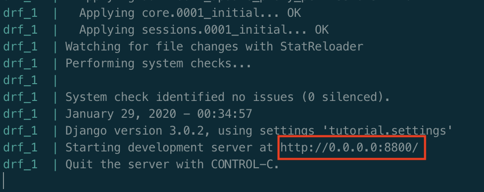
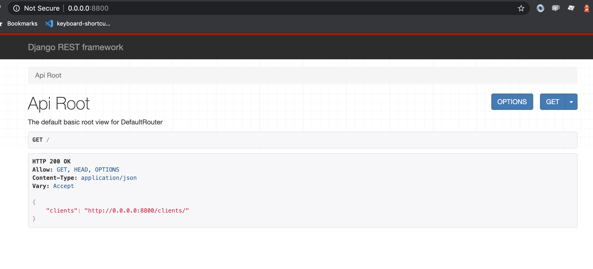
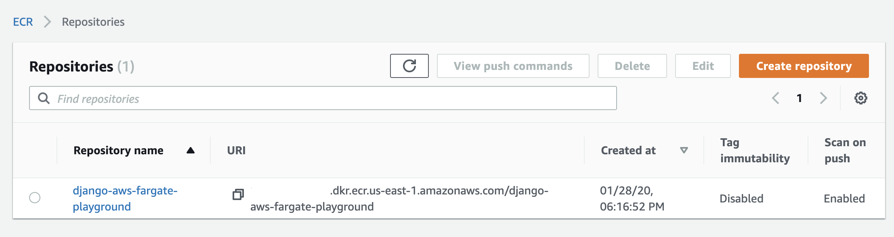
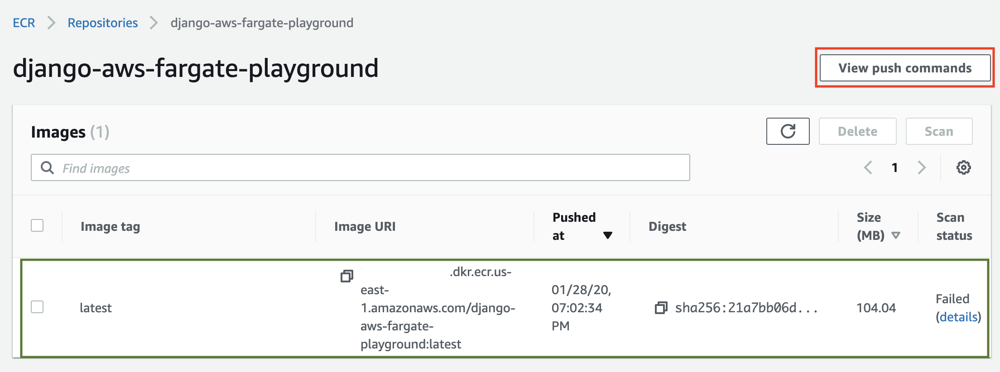
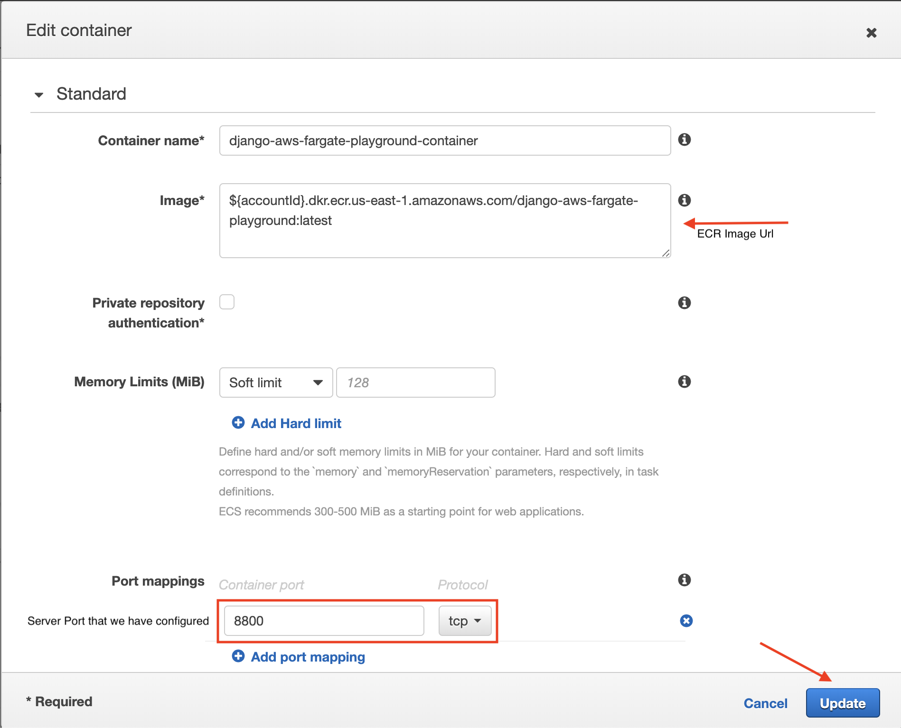

# django-aws-fargate-playground
[](#contributing)

Scalability is an essential software component. Prioritizing it from the start leads to lower maintenance costs, better user experience, and higher agility. 

Thinking in that one of the biggest problem when talking about scalability is the database.

This project is an study case where we will build a very simple API with Django Rest Framework, which consumes data from a serverless postgres database provided by AWS. Then we will dockerize our app and deploy it in an "production environment" using AWS Fargate.

## Requirements

* Django Rest Framework >= 3.11.0 (powerful and flexible toolkit for building Web APIs)
* AWS Account (You need to have an AWS account to deploy the application and to create the database)
* [Docker](https://www.docker.com/) (We will deploy our app using docker containers for this reason you should know docker concepts to understand how things are working).

## AWS Account Creation 

To create and activate a new AWS Account, please follow the steps covered by this article: [How do I create and activate a new Amazon Web Services account?](https://aws.amazon.com/premiumsupport/knowledge-center/create-and-activate-aws-account/).

After that is it important to install [AWS CLI](https://docs.aws.amazon.com/cli/latest/userguide/cli-chap-install.html) which will allow us to do changes at our AWS Account from command line.

Finally, you can [configure your aws credentials](https://docs.aws.amazon.com/cli/latest/userguide/cli-chap-configure.html).

## Running project locally

After clone or download this repository you must configure a file called `.env` inside the main folder `tutorial`. As you can see, inside this folder there is a sample file called `.env.example` that you can copy or rename to `.env`.

This file is where we can configure our environments variables using keys.

| WARNING: be careful in production environment you must configure this variables using other aproach! |
| --- |

For running this project locally, just keep the file with two keys:

```
DEBUG=True
SECRET_KEY=${Put same random and unique value here}
```

When you don't configure a `DATABASE_URL` key by default the app will use Sqlite DB Engine.

After create the `.env` file just run the following command:

```bash
docker-compose up
```

If the command was successful your terminal will show:


The server will be available on http://0.0.0.0:8800/.


## Creating AWS Fargate Cluster

To know more about AWS Fargate you should read the oficial [documentation](https://aws.amazon.com/fargate/).

This chapter will cover the configuration of a AWS Fargate Cluster where we will deploy our application. 

As you have read AWS Fargate is a serverless compute engine for containers so we need to configure the container that will run our application.

### Elastic Container Repository (ECR)

To do this we have created the [Dockerfile](./Dockerfile) that contains the instructions to build a docker image thar can be used to create containeres to run our application.

We will store this docker image in a Elastic Container Repository (ECR). To create this repository you can run the following command:

```bash
aws ecr create-repository --repository-name django-aws-fargate-playground --region us-east-1
```

If the command is successful we should see:

```json
{
    "repository": {
        "repositoryArn": "arn:aws:ecr:us-east-1:${accountId}:repository/django-aws-fargate-playground",
        "registryId": "${accountId}",
        "repositoryName": "django-aws-fargate-playground",
        "repositoryUri": "${accountId}.dkr.ecr.us-east-1.amazonaws.com/django-aws-fargate-playground",
        "createdAt": 1550555101.0
    }
}
```

In AWS console you will see something like this:


After click on the repository name you will see all the images inside that repository. Click on `View push commands` to see a list of commands that we need to run to be able to push our image to ECR. Follow the steps as they are given.

Now we have pushed our image in ECR.



After pushing the image you can see the second column called Image URI (we will use this info to configure the Task container in AWS Fargate).

### AWS Fargate

Now, let us go to the link https://console.aws.amazon.com/ecs/home?region=us-east-1#/getStarted and create a new Fargate Application. Click on `Get Started`.

Now select under the container definition choose Custom and click on Configure.


In the popup, enter a name for the container (django-aws-fargate-playground-container) and add the URL to the container image we have pushed to ECR in the step before.



## Creating Aurora Serverless Database

## Deploying app

## Contributing

Yes, please!
This project was created just for study and to guide other developers who would like to use this tecnologies. Any other suggestion will be kindly accepted!
